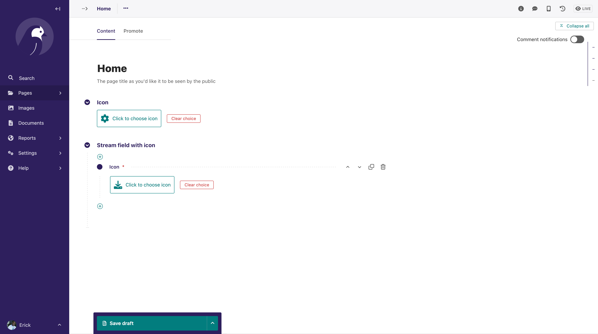
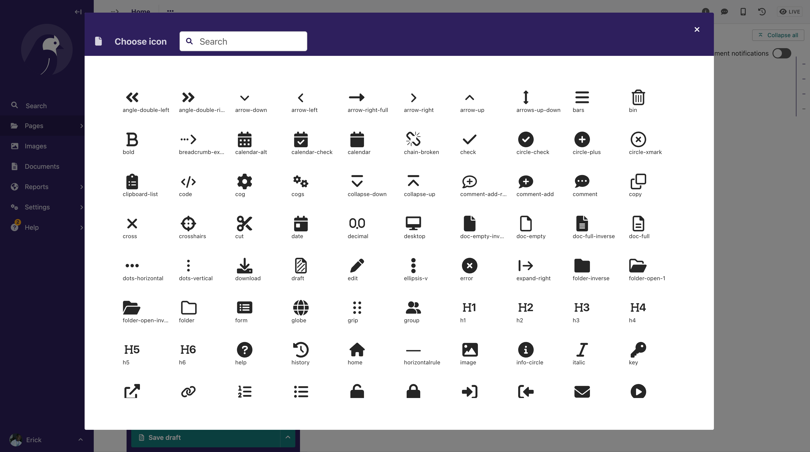

# Wagtail Icon Chooser

Icon chooser widget for Page/Model fields and Stream Field

# Installation

```
pip install wagtail-icon-chooser
```

Add `wagtailiconchooser` to your installed apps

```
 INSTALLED_APPS = [
        ...
        "wagtailiconchooser",
        ...
        ]
```

# Usage

- Use `wagtailiconchooser.widgets.IconChooserWidget` in FieldPanels
- Use `wagtailiconchooser.blocks.IconChooserBlock` in StreamField blocks

```python
from django.db import models
from wagtail.admin.panels import FieldPanel
from wagtail.fields import StreamField
from wagtail.models import Page

from wagtailiconchooser.blocks import IconChooserBlock
from wagtailiconchooser.widgets import IconChooserWidget


class MyPage(Page):
    icon = models.CharField(max_length=100, null=True, blank=True)
    stream_field_with_icon = StreamField([
        ('icon', IconChooserBlock()),
    ], use_json_field=True, blank=True, null=True)

    content_panels = Page.content_panels + [
        FieldPanel("icon", widget=IconChooserWidget),
        FieldPanel("stream_field_with_icon"),
    ]
```

# Screenshots

- Icon Chooser Widgets for Page field and Stream field



- Icon List Modal



# Showing icons on your frontend templates

The Icons can be used out of the box in templates rendered on the Wagtail admin, without any custom configuration.

Below are two possible ways of getting your svg icon to show on your custom frontend template:

### 1. Including individual SVG markup

You can use the `svg_icon` template tag as below:

```html


....



<div>
    
</div>



.....
```

### 2. Using SVG Sprites

- Add all icons to your template's context, and have them as a svg sprite. Wagtail provides a way to get all the admin
  icons as a svg sprite, using a view found at `wagtail.admin.views.home.icons`
- Add the svg sprite to your template
- use the `icon` template tag from `wagtailadmin_tags` to render your svg, which will the link with the icon from the
  svg sprite
- or directly render the svg to the template

We provide custom abstract page `CustomIconPage`, that helps you to achieve the above.

This just overrides the `get_context` method of the Wagtail Page class, to add the svg sprite string.

```python
from django.db import models
from wagtail.admin.panels import FieldPanel
from wagtail.models import Page

from wagtailiconchooser.models import CustomIconPage
from wagtailiconchooser.widgets import IconChooserWidget


class MyPage(CustomIconPage, Page):
    icon = models.CharField(max_length=100, null=True, blank=True)

    content_panels = Page.content_panels + [
        FieldPanel("icon", widget=IconChooserWidget)
    ]
```

Your template will now have a svg sprite `context` object, with the key `icons_svg_sprite`

You can add the svg sprite anywhere in the template, and use the `icon` tag

```html


....




{{ icons_svg_sprite|safe }}


<div>
    
</div>




.....
```

You can also directly render your icon without using the `icon` from `wagtailadmin_tags` template tag,
since`wagtailadmin_tags` is clearly meant to be used on the admin side of things.

Just replace `` with

```html

{{ icons_svg_sprite|safe }}

<svg class="icon">
    <use href="#icon-{{ page.icon }}"></use>
</svg>
```

`NOTE` This approach will load all the icons added to Wagtail (using the `register_icons` hook) to your template. If you
have registered many SVG icons, this might increase your page's loading bandwidth and might not be efficient since you
might not use all the icons.
